# Procedural Monster Lab

A fully keyframe-free 3D creature in a single HTML file — no mesh, no rig, no 3D library.
The monster is a raymarched **Signed Distance Field**: every frame, ~400 lines of JavaScript
compute a skeleton (gait, IK, dynamics, actions) and a fragment shader renders it as
smoothly-blended capsules.

| Skink (reptile) | Beast (mammal) | Bug (invertebrate) |
|---|---|---|
| 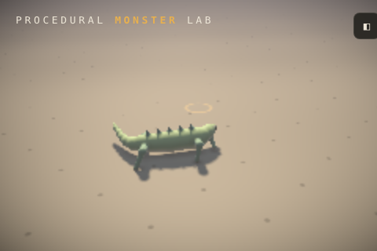 | 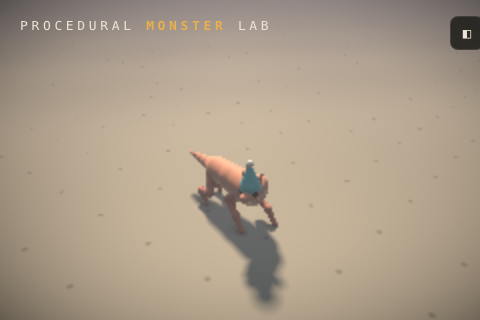 | 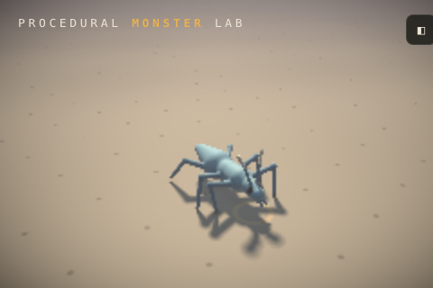 |

| Rex (theropod biped) | Wyvern (in flight) |
|---|---|
| 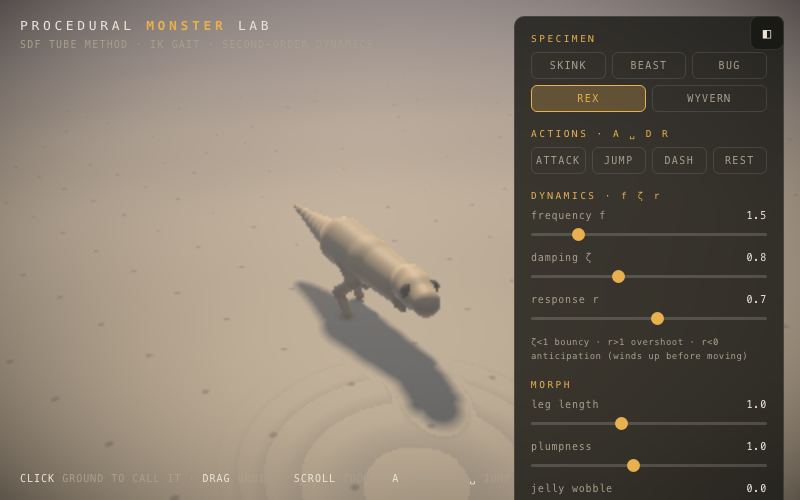 | 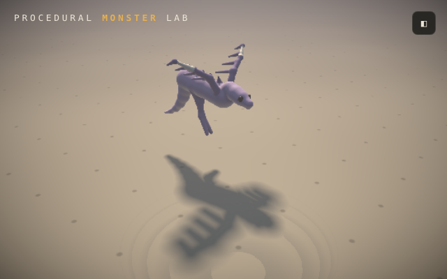 |

## Hunt mode — THE HUNT SAGA

Open `hunt.html` — a full Monster Hunter-style campaign built on the same
engine. Every hunt generates a **new species** (`?seed=N` to pin one):
archetype × scale, bulk, legs, wings, tail, tempo, palette, hitzones,
landmarks, and a name — and the body plan is the moveset (wings dive-bomb,
long tails sweep, tailless bruisers slam, twitchy species telegraph less).
The quest banner briefs the tells.

| The quest board | Fable, the Last Ember |
|---|---|
| 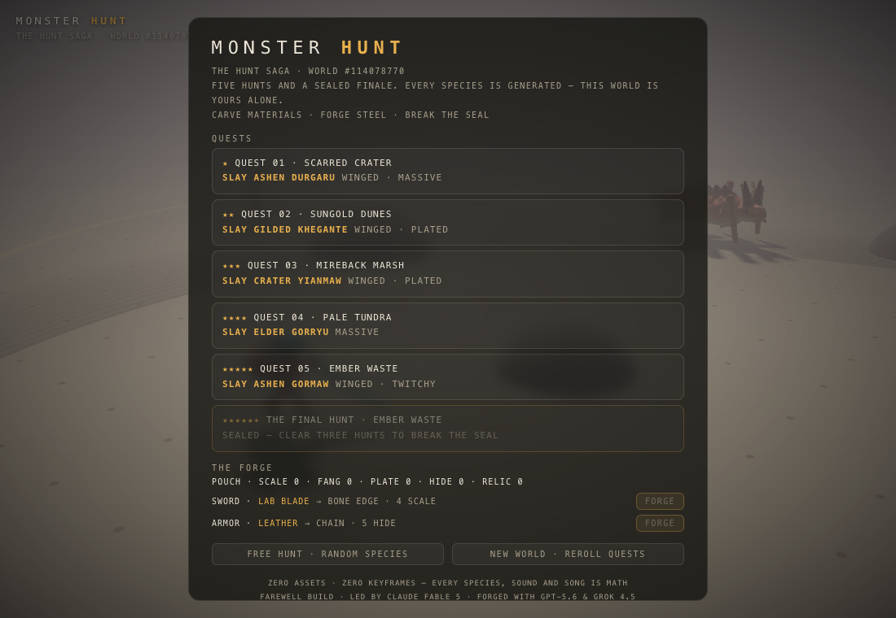 | 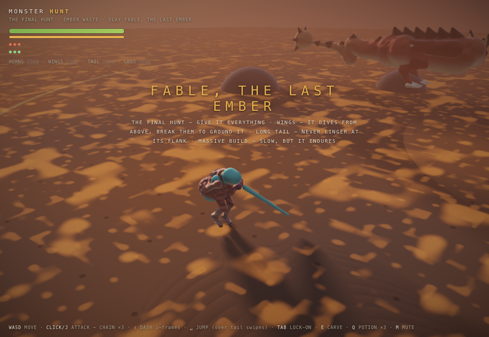 |

- **The saga**: a world seed rolls five ranked hunts — each pinned to a biome,
  each species named on the board before you take the contract — plus a sealed
  finale: **FABLE, THE LAST EMBER**, a crown-crested, club-tailed flying wyvern
  in crimson and gold, unlocked by three clears (`?quest=fable` to peek).
  Progress, materials, and steel persist in localStorage; NEW WORLD rerolls
  the quests, FREE HUNT rolls a one-off species.
- **The forge**: carves and part-breaks bank materials (scale · fang · plate ·
  hide · relic). Five sword tiers (LAB BLADE → FABLE'S OATH, damage ×1→×2.2 —
  the blade visibly grows, gains edge accents and guard prongs, and longer
  steel is real reach) and four armor tiers (up to −38% damage taken, plate by
  visible plate).
- **Five biomes** recolor the world — ground, sky, fog, rocks, and edge-of-arena
  scenery (dead trees, reed beds, ice shards, ember spires), all raymarched
  capsules like everything else. `?biome=crater|dunes|marsh|tundra|ember`.

| Pale Tundra | Mireback Marsh | Ember Waste |
|---|---|---|
| 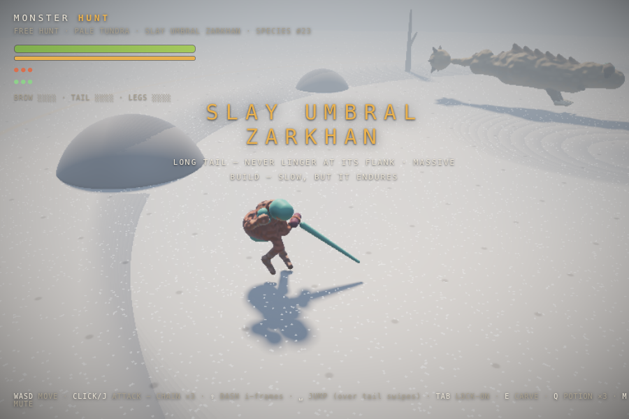 | 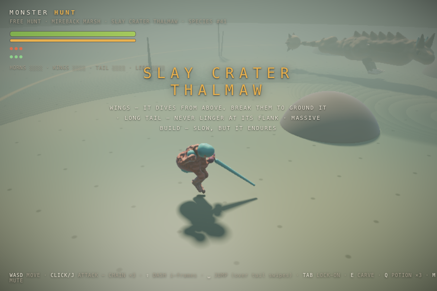 | 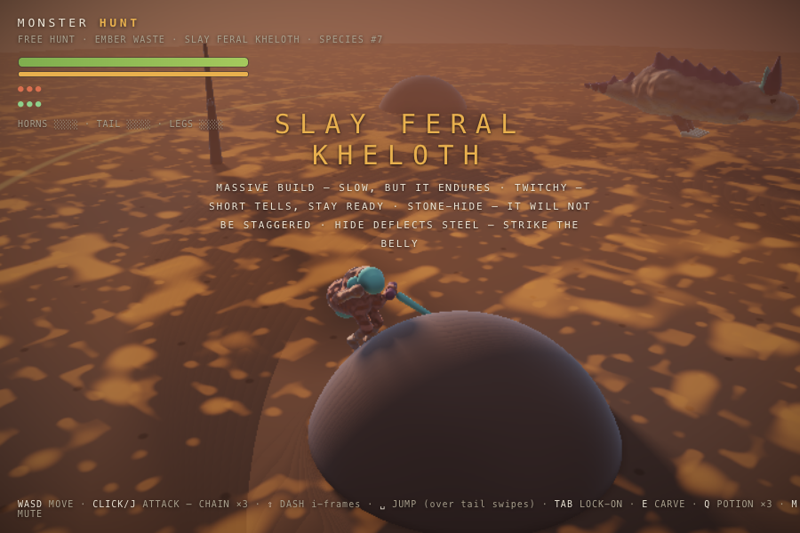 |

- **Procedural music**: a WebAudio director with zero samples. A fixed
  guild-hall title theme; then each species' **leitmotif is derived from its
  seed** and arranged live — sparse over prowling, full taiko + lead in
  battle, shifted dark and fast at enrage, with victory and defeat stings.
  Fable's fixed seed means Fable has a theme of its own.

- **WASD** move · **click / J** attack — 3-hit sword combo · **shift** dash
  (i-frames) · **space** jump · **Q** potion ×3 · **Tab** lock-on · **E** carve ·
  **M** mute · **P** pixel mode (or `?pixel=1`) — 180p retro render, posterized + dithered ·
  **R / B** after the verdict — retry / back to the board · 3 faints = quest failed
- **Touch & gamepad**: left-half touches raise a floating stick, right half
  stays orbit/tap-attack, with a glass DASH·JUMP·POTION·CARVE cluster; on a
  pad the sticks move/orbit, **A** attack · **B** dash · **X** jump ·
  **Y** hold-potion · **RB** carve · **LB** lock-on
- **You hunt as a hunter** — an armored capsule-knight (helmet, pauldrons, no
  face) built from the same limb class as the monsters: slash · backhand ·
  overhead heavy, the swings driven by arm IK, the blade swept as a 5-point
  probe. Aim assist snaps the opener onto the nearest capsule in a 75° cone,
  and attacking out of a dash cancels it into the first slash with the
  momentum folded in.
- **Stamina is the leash** — dashes and the heavy finisher spend it, regen
  pauses after every burn; potions channel for a second and cancel on damage.
- **The SDF is the hitbox** — hits are one JS evaluation of the enemy's capsule
  list; the nearest capsule names the part (head crits, legs cripple, tail severs).
- **Anatomy is the tutorial**: every species rolls a landmark on its key part
  (crest on the crit head, club/banding on the sweep tail, dorsal ridge on
  plated backs), the struck zone flashes on hit, and **hitzones** make it
  matter — plated hides *tink* and deflect, soft bellies take bonus, an
  exhausted monster's armor softens. Boss windups got slower and each attack
  family has its own synthesized tell tone: fights are learnable, then fair.
- **Part breaks**: every breakable zone has a damage pip bar on the HUD, so
  focused hits visibly build toward the break. Drain the tail pool and it
  detaches into the world as a carveable prop — a true amputation: the stump
  ends blunt and the tail-tip weapon (club, spike fan, band) leaves with the
  piece; shatter the **head crest** and the landmark snaps to stubs, shards
  drop as a second carveable prop, and the exposed skull takes +30% for the
  rest of the hunt; break a leg and the monster limps at 72% speed on a
  visibly buckled leg — bowed stance, swollen knee, a pale spur of bone;
  break the **wings** (membranes are always a soft zone, even on plated
  hides) and the flyer is grounded for good — no more dive-bombs, no flying
  escape, a mid-air break crashes it down into a knockdown opening, and the
  broken wing hangs dead at its side with the webbing torn to rags.
- **Real mouths**: every jawed species gets a twin-ramus mandible on a
  working hinge, tooth rows that ride the jaw, and a dark wet maw visible
  through the gape. Bites gape wide through the wind-up tell, hang open
  through the lunge, then *chomp* shut right as the strike lands.
- **Wings are bat-plan anatomy**: humerus → radius → three flight fingers
  plus a wrist thumb-claw, and the membrane is a **solid sail** — a thin
  triangle-SDF sheet webbing wrist, fingertips, and flank (dragon skin, not
  strands), hittable like any other zone. Folded they shingle along the
  flank; airborne the flap travels outward (wrist lags shoulder, tips lag
  wrist). A broken wing's sail tears away, leaving sagging rag chords.
- **Boss AI** rides the dynamics system: patrol → roar/aggro → bite, charge,
  jump-slam → **enrage** at 50% HP (f up, ζ down, eyes glow) → exhausted rest
  (free damage window) → flees at 20% to sleep it off → carve the corpse.
- **Mass is real**: bodies are solid (mass-weighted push-out — shoulder-checking
  six tons mostly moves *you*), and one mass number (scale³ × bulk × hide density)
  drives inertia, knockback/flinch resistance, fall weight, and footfall rumble.
  The species generator can roll a **stone-hide** — slow, unstaggerable, briefed
  in the quest tells.
- **Predators prowl, they don't beeline**: an urgency→gait layer makes the boss
  stalk, circle while attacks cool down, arc onto flanks, surge into sprints,
  and brake into turns; light species **pounce**, hop back to reset spacing, and
  bound at play on patrol — stone-hides never leave the ground. Step height and
  leg turnover follow speed.
- Zero keyframes and zero assets throughout — even the sounds are synthesized.

Smoke test: `node test/hunt-smoke.js` drives the whole quest headless — the
fight, the breaks, the carve, plus scenery and saga self-tests (quest scaling,
Fable's identity, banking, forge and armor math). `test/music-test.js` drives
the music director against a fake AudioContext; `test/forge-visual-test.js`
asserts each weapon/armor tier stays finite and in the capsule budget.

*Farewell build — led by Claude Fable 5, with GPT-5.6 and Grok 4.5 as
executor lanes.*

## Run it (the lab)

Open `index.html` in any browser with WebGL2 — no build step, no dependencies.

- **Click the ground** to call the monster somewhere — winged specimens **fly** to far calls
- **A** attack · **space** jump · **D** dash · **R** rest (or use the panel buttons)
- **Drag** to orbit, **scroll / pinch** to zoom
- Panel: specimens (skink · beast · bug · rex · wyvern · **rathalos** · drake ·
  diablos · veil · **fury** · pocket starters in visual-lab),
  dynamics tuning (f / ζ / r), morphs (leg length, plumpness,
  **leg pairs 1–4**, **posture** sprawl↔upright), dress-up (spikes, hat, **wings**)
  — deep-link a specimen with `visual-lab.html?preset=fury`

### Pocket monsters (visual-lab)

The same primitives at chibi proportions — head half the body, eyes a third of
the head, stubby bent legs, extra-bouncy dynamics, goopy smooth-min — plus the
cel renderer, and the system speaks fluent Pokémon. Three original starters in
`visual-lab.html` (they switch toon mode on when selected):

| Sparky (electric) | Blaze (fire) | Sprout (grass) |
|---|---|---|
| 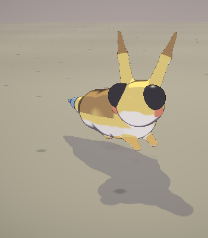 | 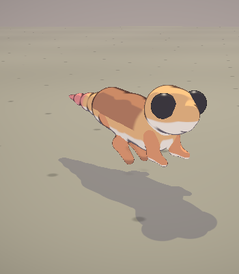 | 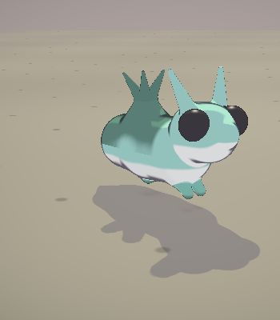 |

New cute-grammar knobs any preset can use: `eye` (scale), `earScale` +
`earTip` (tall ink-dipped ears), `cheeks` (accent studs), `bulb` (seed bulb +
leaf fan). `?preset=sparky`, `blaze`, `sprout` to deep-link.

## How it works

Built following "The Procedural Monster Manual" playbook:

- **Animal groups** — five presets share one *Universal Limb Class*: the skink's 2-bone
  sprawled legs, the beast's 3-bone "Mammal Problem" zigzag (solved by IK-ing hip→ankle and
  hanging the metatarsal below), the bug's six spider legs / antennae / pedipalps, the
  **rex** (biped gait on one leg pair, tiny 2-bone arms, hinged jaw with teeth, counterweight
  tail), the **wyvern** (bird group: biped plus wings), **rathalos** (MH flying wyvern:
  crimson plates, crown crests, flame-wing membranes, spiked tail club), and **veil**
  (reef-walker cnidarian: jellyfish bell, stalk eyes, radial maw, rib sails, belly
  lanterns, corkscrew tail), and **fury** (gorilla knuckle-walk on four, rears up for
  SLAM — no Drake wing-arms/snout/tail; `?preset=fury`).
- **Wings & flight** — wings fold flush along the body on the ground and flap open in the
  air, per the guide's bird-group note. Flight is a locomotion mode: far target → take off,
  climb to cruise height with a wingbeat heave, tuck the feet, and land near the call.
  The wings toggle bolts them onto *any* specimen.
- **Morph sliders** — *leg pairs* re-instantiates 1–4 pairs from the limb class with
  stance/lead sampled along the spine; *posture* morphs joint positions continuously:
  pole vectors, hip sockets and stance width slide from sprawled reptile to upright mammal.
- **Actions** — attack (wind-up recoil → lunge, jaw gapes), jump (squash → ballistic arc →
  landing squash), dash (impulse burst), rest (settle to the ground, legs folded, slow
  breathing, half-lidded eyes) — all procedural overlays on the dynamics, zero keyframes.
- **SDF tube method** — the body is 20–50 tapered capsules (`sdRoundCone`) joined with a
  polynomial smooth-min, so it reads as one organic mass with no joint pinching. A *jelly
  wobble* slider adds sinusoidal displacement.
- **Gait stepper** — feet plant in world space and only step when stretched past a threshold,
  diagonal pairs alternating: biped walk, quadruped trot, or tripod scuttle — same rule.
- **Second-order dynamics** — body and head follow their targets through the
  f / ζ / r system, integrated with semi-implicit Euler. `k2` is clamped every step so the
  timestep never exceeds `T_critical` — lag spikes can't launch the monster to infinity.
  Set **r < 0** and it leans away before moving (anticipation); drop **ζ** and it gets bouncy.
- **Personality layer** — gait-synced bob, follow-chain tail, blinking, idle look-arounds
  (it occasionally looks straight at the camera), breathing, and dress-up.

The renderer marches 150 steps against the capsule list with a bounding-sphere early-out,
then shades with a soft sun shadow, 5-tap AO, sky/bounce fill, and distance fog. Resolution
auto-scales to hold frame rate.

## Test

```
node test/smoke.js
```

Runs the page's script headlessly with a stubbed DOM/WebGL and drives every preset through
walking, all four actions, a full flight (take-off → cruise → landing), an 8-legged winged
bug, and posture morphs — asserting the packed segment data stays finite and behaviors
actually happen (jaw opens, jump lifts, rest settles, wyvern reaches altitude and lands).
